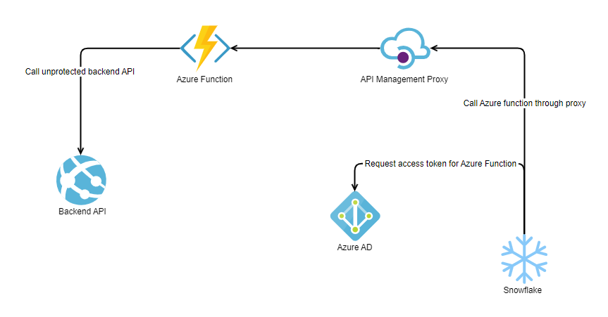

- [About repo](#about-repo)
- [Query data from third-party APIs inside Snowflake](#query-data-from-third-party-apis-inside-snowflake)
  - [Concept explained with a simple example](#concept-explained-with-a-simple-example)
    - [Understanding Input and Output](#understanding-input-and-output)
    - [Agify Implementation](#agify-implementation)
  - [Other examples](#other-examples)
  - [Snowflake integration](#snowflake-integration)
    - [Code snippets](#code-snippets)
- [Cost](#cost)
- [Known limits](#known-limits)

---

# About repo
This repo contains Azure Function examples that integrate third-party APIs and can be integrated with Snowflake External Functions so you can use them from the Snowflake Editor. Its purpose is to provide some examples to illustrate the concept.

You can read the whole concept with an explained example in our [blog post](./) or continue reading here.


# Query data from third-party APIs inside Snowflake

We had a requirement to access data from an external source in Snowflake. Our external source is web application data. Since the users of the web application are constantly changing the data, we needed to make sure that the data in Snowflake is always up to date.

The traditional approach would be to sync our web application database with Snowflake using ETL jobs. Sync processes can be complex, so we wanted to try an approach where we get the data on-demand directly from our web application API and we would not need to worry about when and where to sync the data to Snowflake. External data also does not need to be stored in Snowflake, since it's already stored in the web application.

In the Snowflake documentation, we found Snowflake external functions that can call cloud infrastructure like Azure functions. We came up with the idea that we could write our custom logic in Azure Functions, where we could parse the data sent from Snowflake and retrieve our API input parameters. Then we could implement the required authentication for the third-party API. We then pass those parameters to the API and the results from the API would then be returned to Snowflake in the required format. In essence, Azure Functions serves as an intermediary between Snowflake and the third-party APIs. Parameters allow us to request only the data we actually need from our source. Parameters can also be used for data manipulation. This can give users write and update capabilities on the source data within the Snowflake editor.

## Concept explained with a simple example
Let's use a simple example to illustrate the concept using the unprotected API [Agify](https://agify.io/), which predicts the age of a name.

Using a traditional GET request, for example `https://api.agify.io/?name=Michael`, we would get a response like this:
```JSON
{
    "name": "Michael",
    "age": 70,
    "count": 233482
}
```

### Understanding Input and Output

For Azure functions to interoperate with Snowflake external functions, it is required that input and output data is in a specific [format](https://docs.snowflake.com/en/sql-reference/external-functions-data-format.html). Snowflake sends and expects data in a scalar format, as shown in the snippets below and it is the same for input and output. This scalar format means that if you send 3 rows of input, 3 rows of output are expected in response.
```JSON
{
    "data":[
        [0, "Joe"],     // row 1 
        [1, "Tim"],     // row 2
        [2, "Michael"]  // row 3
    ]
}
```
The first column represents the row number and is mandatory. In the other columns we can specify other parameters. In this example, the second column is an additional parameter of type `varchar` and will be our input for external API calls. 

We have created a helper class for input and output data named `SnowflakeData.cs`
```C#
public class SnowflakeData
{
    public List<List<dynamic>> data { get; set; } = new List<List<dynamic>>();
}
```
 With this class, we can deserialize the data sent by Snowflake directly into an object that we can work with inside Azure functions.
```C#
public static async Task<IActionResult> Run(
    [HttpTrigger(AuthorizationLevel.Function, "post", Route = null)] HttpRequest req,
    ILogger log)
{

    string requestBody = await new StreamReader(req.Body).ReadToEndAsync();

    SnowflakeData inputData = JsonConvert.DeserializeObject<SnowflakeData>(requestBody);
    
    var outputData = new SnowflakeData();
    foreach (var row in inputData.data)
    {
        // Row processing
        List<dynamic> dynamicList = new List<dynamic>();
        var rowNumber = row[0];
        var name = row[1];
        dynamicList.Add(rowNumber); 

        // your custom logic
        // dynamicList.Add(new { ADD ADDITIONAL OUTPUT DATA });

        outputData.data.Add(dynamicList);
    }
    return new JsonResult(outputData);

}
```


### Agify Implementation
Now let's implement the whole logic for Agify API. For example, we can have a table like shown below, named Users in Snowflake. 

| row_id | user_name |
| -------| ----------|
| 1      | Joe       |
| 2      | Tim       |
| 3      | Michael   |

For these users, we would like to get their age and this data is in another application that has an API endpoint. So, let's implement an Azure function that can do that. This is the code for Agify external function:

```C#
 public static class UnprotectedApiExample
    {
        // Initialize HTTP Client
        static HttpClient client = new HttpClient();

        [FunctionName("UnprotectedApiExample")]
        public static async Task<IActionResult> Run(
            [HttpTrigger(AuthorizationLevel.Function, "post", Route = null)] HttpRequest req,
            ILogger log)
        {
            log.LogInformation("C# HTTP trigger function UnprotectedApiExample processed a request.");

            // Get request parameters sent from Snowflake
            string requestBody = await new StreamReader(req.Body).ReadToEndAsync();
            SnowflakeData data = JsonConvert.DeserializeObject<SnowflakeData>(requestBody);

            string apiBaseUrl = "https://api.agify.io"; 
            // Or read it from config
            // string apiBaseUrl = Environment.GetEnvironmentVariable("ApiBaseUrl", EnvironmentVariableTarget.Process);

            var sfReturnData = new SnowflakeData();
            long counter = 0;
            foreach (var dataItem in data.data)
            {
                List<dynamic> dynamicList = new List<dynamic>();
                dynamicList.Add(counter++);
                
                // Get the name parameter sent from Snowflake
                string name = $"{dataItem[1]}";
                try
                {
                    // Make HTTP calls to third-party API with parameters
                    HttpResponseMessage response = await client.GetAsync($"{apiBaseUrl}?name={name}");

                    if (response.IsSuccessStatusCode)
                    {
                        var responseContent = await response.Content.ReadAsAsync<dynamic>();

                        dynamicList.Add(responseContent);
                    }
                    else
                    {
                        var body = response.Content.ReadAsStringAsync().Result;
                        throw new Exception(body);
                    }


                }
                catch (Exception ex)
                {
                    // Return a special response with an exception message for failed requests if they happen
                    log.LogError(ex, ex.Message);
                    dynamicList.Add(new ExternalFunctionException { ExceptionMessage = $"name: {name} errorMessage: {ex.Message}" });
                }
                sfReturnData.data.Add(dynamicList);

            }

            return new JsonResult(sfReturnData);
        }
    }
```
Within the Snowflake editor we can then call our external function with a call like this:
```SQL
 select GetAge(user_name) from Users;
```
> **Note:**
> Azure functions must be deployed to Azure and integrated into Snowflake for this to work. Follow the [integration process](#snowflake-integration)

This external function call will create a POST call to a registered Azure function endpoint with body data formatted like this:
```JSON
{
    "data":[
        [0, "Joe"],
        [1, "Tim"],
        [2, "Michael"]
    ]
}
```
And as a result, we will get data output formatted like this with JSON data in the second column:

```JSON
{
    "data": [
        [
            0,
            {
                "name": "Joe",
                "age": 54,
                "count": 56314
            }
        ],
        [
            1,
            {
                "name": "Tim",
                "age": 56,
                "count": 45214
            }
        ],
        [
            2,
            {
                "name": "Michael",
                "age": 70,
                "count": 233482
            }
        ]
    ]
}
```
In Snowflake we can then use JSON processing capabilities to transform raw JSON into a table with [flatten functionality](https://docs.snowflake.com/en/user-guide/json-basics-tutorial-flatten.html). 

When we flatten the JSON result the table could look like this:
| row_id | user_name |age    | count    |
| -------| ----------|-------| ---------|
| 1      | Joe       |54     | 56314    |
| 2      | Tim       |2      | 45214    |
| 3      | Michael   |3      | 233482   |

This is how the architecture looks like for this example: 


Basically, this is how the concept works. Most APIs are protected and have different types of protection. Therefore, we have prepared some Azure function examples (wrappers) that demonstrate how you can call these protected APIs. You can see the examples in our GitHub repository.


## Other examples

We have prepared:

- A simple example using an [unprotected API](./SnowflakeExternalFunctions/UnprotectedApiExample/UnprotectedApiExample.cs)

- An example with API that uses basic access authentication ([Vtiger CRM integration with Snowflake](./SnowflakeExternalFunctions/VtigerExample/README.md))

- An example that calls the Microsoft Graph API ([Microsoft Graph and Snowflake integration](./SnowflakeExternalFunctions/MicrosoftGraphExample/README.md))


You can join us in the repository and contribute your API integration example. 


## Snowflake integration

Follow the [official step-by-step guide](https://docs.snowflake.com/en/sql-reference/external-functions-creating-azure-ui.html) for integrating external functions, except that you use your own custom Azure functions. This means deploying them to the cloud and proceeding with the guide from  [this point](https://docs.snowflake.com/en/sql-reference/external-functions-creating-azure-ui-remote-service.html#enable-app-service-authentication-for-the-azure-function-app) on.

### Code snippets

Integration:

```sql
create or replace api integration YOUR_INTEGRATION_NAME
api_provider = azure_api_management
azure_tenant_id = '<azure_tenant_id>'
azure_ad_application_id = '<azure_ad_application_id>'
api_allowed_prefixes = ('<link_to_api_allowed_prefixes>')
enabled = true;
```

Function registration:
```sql
create or replace external function YOUR_FUNCTION_NAME_IN_SNOWFLAKE(user_name varchar)
returns variant
api_integration = YOUR_INTEGRATION_NAME
as '<link_to_api_allowed_prefixes>/<your_azure_function_name_in_api_management>';
```

# Cost 

- [Azure functions pricing](https://azure.microsoft.com/en-us/pricing/details/functions/) is currently very affordable. You can have 1 million executions per month for free. 

- But [API Management pricing](https://azure.microsoft.com/en-us/pricing/details/api-management/) can be a bit more expensive with a minimum cost of around 40 USD per month in developer tier configuration. 
  
- [Snowflake Billing for External Functions Usage](https://docs.snowflake.com/en/sql-reference/external-functions-introduction.html#billing-for-external-functions-usage)

# Known limits

- Snowflake External functions [limitations](https://docs.snowflake.com/en/sql-reference/external-functions-introduction.html#limitations-of-external-functions).
