# Microsoft Graph API example

- [Microsoft Graph API example](#microsoft-graph-api-example)
  - [Architecture](#architecture)
  - [Configuration](#configuration)
  - [App registration](#app-registration)
  - [Calling Microsoft Graph example with SDK](#calling-microsoft-graph-example-with-sdk)


---

For calling Microsoft Graph API we need to configure our access first. We need to create new App Registration in [Azure portal](https://portal.azure.com/) with appropriate scopes. In this example, we will get all AD groups in our organization. If you have other requirements you can explore Microsoft Graph capabilities with [Graph Explorer](https://developer.microsoft.com/en-us/graph/graph-explorer).

## Architecture 

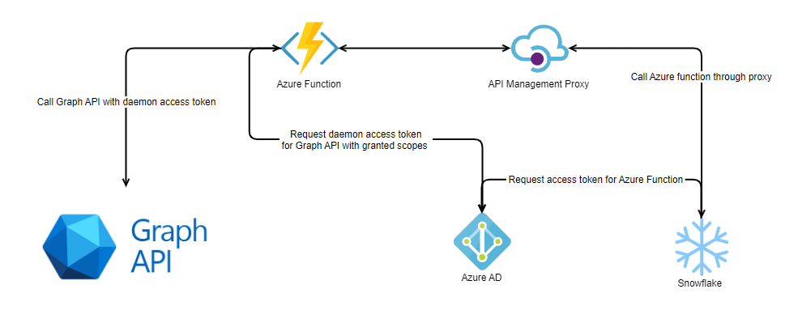

## Configuration
> **NOTE:**
> Before you begin with the next step create a `local.settings.json` file with these properties inside a project root. This configuration file will be used when running Azure functions locally for testing. 


```json
{
  "IsEncrypted": false,
  "Values": {
    "AzureWebJobsStorage": "UseDevelopmentStorage=true",
    "FUNCTIONS_WORKER_RUNTIME": "dotnet",
    "Instance": "https://login.microsoftonline.com/{0}",
    "Tenant": "TENANT_ID",
    "ClientId": "CLIENT_ID",
    "ClientSecret": "CLIENT_SECRET"
  }
}
```

When you publish to the Azure cloud append these settings in `Settings > Configuration` with this format: 
```json
  {
    "name": "Instance",
    "value": "https://login.microsoftonline.com/{0}",
    "slotSetting": false
  },
  {
    "name": "Tenant",
    "value": "TENANT-ID",
    "slotSetting": false
  },
  {
    "name": "ClientId",
    "value": "DAEMON-AUTH-APPLICATION-ID",
    "slotSetting": false
  },
  {
    "name": "ClientSecret",
    "value": "DAEMON-AUTH-APPLICATION-SECRET",
    "slotSetting": false
  }
``` 

## App registration

1. Go to Azure portal and find Azure Active Directory  
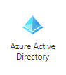

2. Find App Registration  
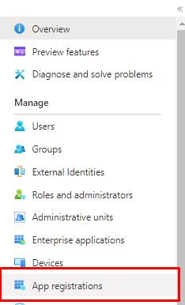

3. Create New Registration  
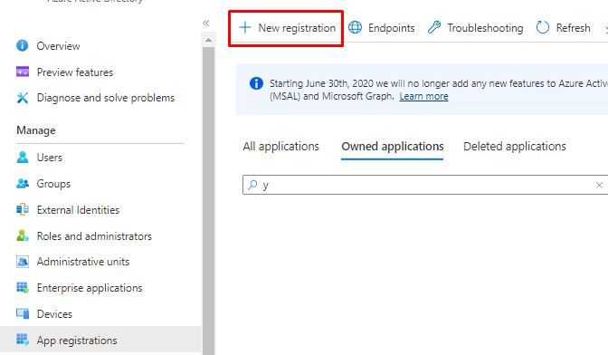

4. Register new app  
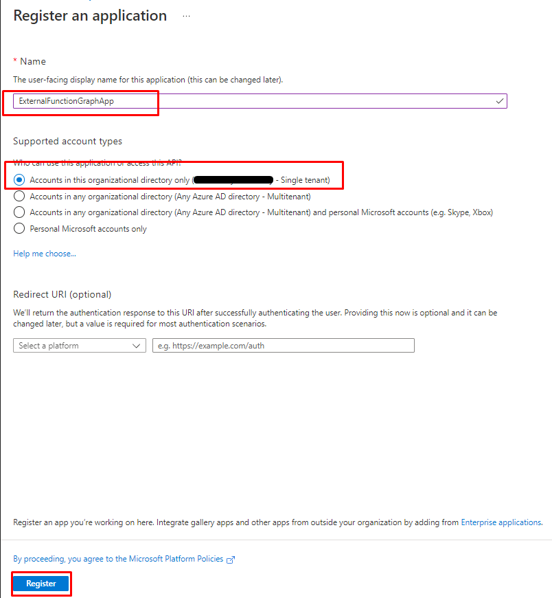

5. Store Application (client) ID and Directory (tenant) ID to  
[configuration file](#configuration)  
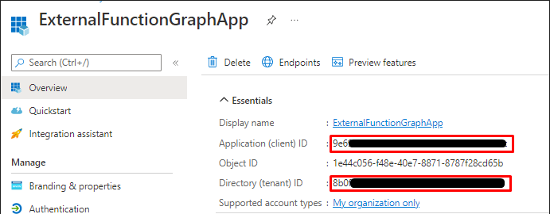

6. Create new client secret  
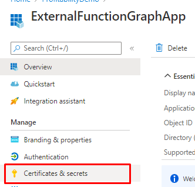  
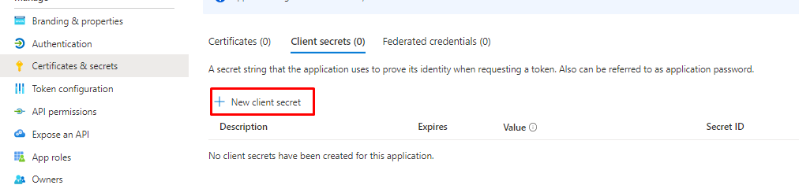  
You can set custom secret expiration duration.  
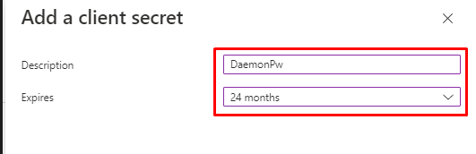  
Store the value to [configuration file](#configuration)  
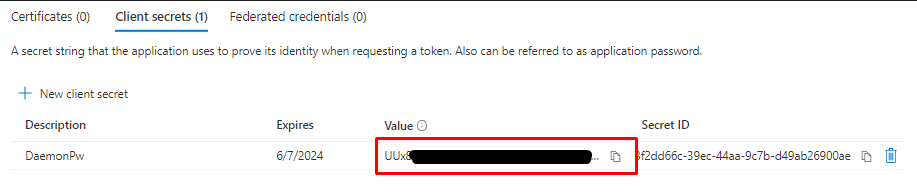

7. Add API permisions (scopes)  
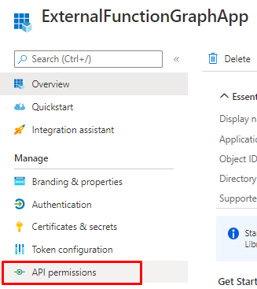  
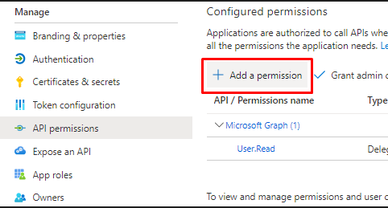  
Select Microsoft Graph.  
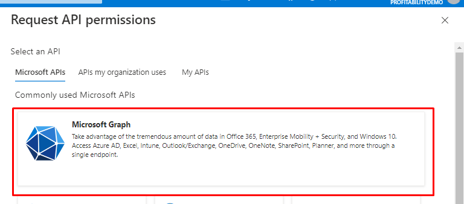  
For Daemon services `Application permission` is required. (Select additional scopes if you need them)  
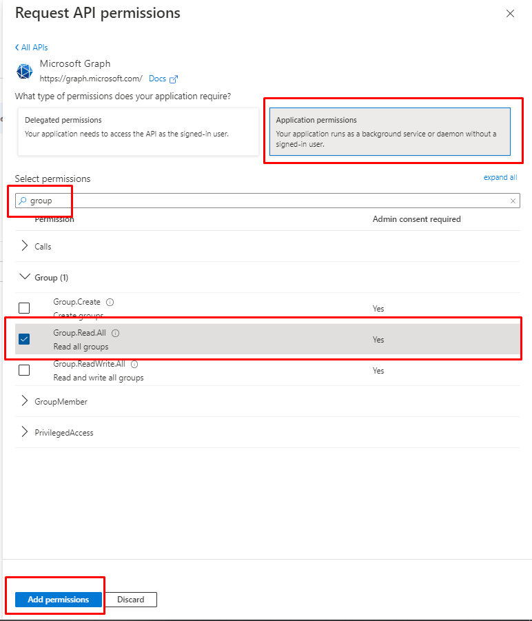  
Grant Admin consent to allow this application to query data.  
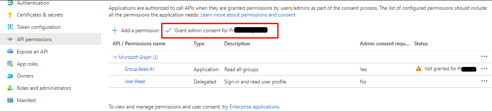  
After consent:  
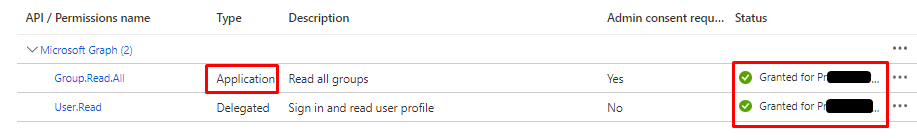


## Calling Microsoft Graph example with SDK

Once you have gathered all the values in the [configuration file](#configuration) you can try the [MicrosoftGraphExample.cs](./MicrosoftGraphExample.cs). In this example we are using Microsoft Graph SDK. We created a helper method `GetClient()` in the [`Authenticate.cs`](../HelperClasses/Authentication/Authenticate.cs) file that returns us an authenticated graph client that we can use to get Microsoft Graph data. 

```C#
 // Create Authenticate instance with logger and configuration settings
 var authenticate = new Authenticate(log);
// Create authenticated client instance
var graphClient = authenticate.GetClient();
// Use client to query graph data
var result = await graphClient
    .Groups
    .Request()
    .GetAsync();
```

